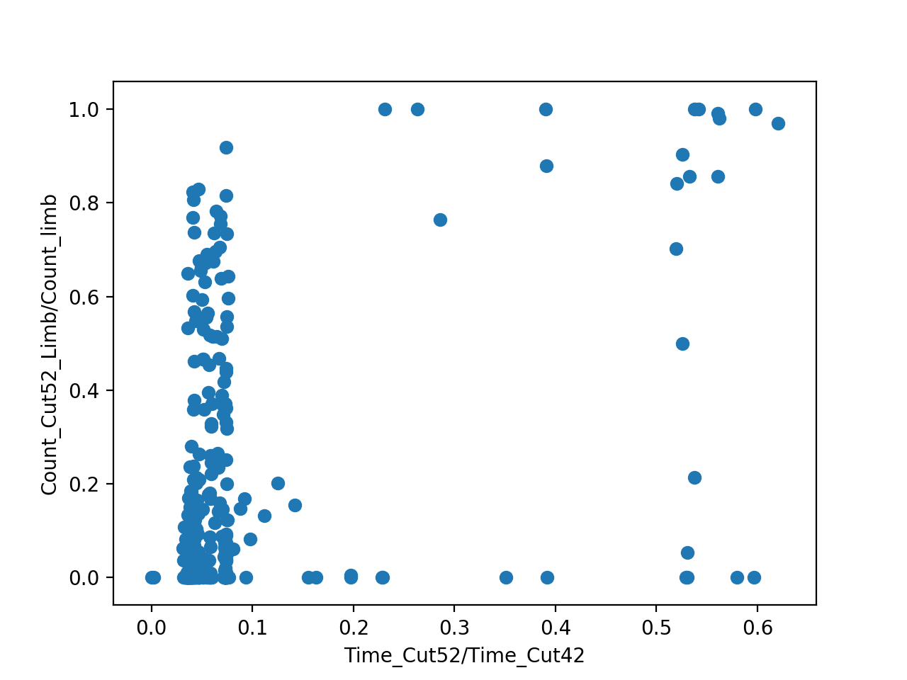

# issue : For investigate relation of count and time fraction for limb and overall
* [x] Find t ( theta_ROCK > 52 ) / t ( theta_ROCK > 42 )
* [x] Find C ( R > 52 , 68.4 < theta_nadir < 70 ) / C ( 68.4 < theta_nadir < 70 )

<!--  -->

